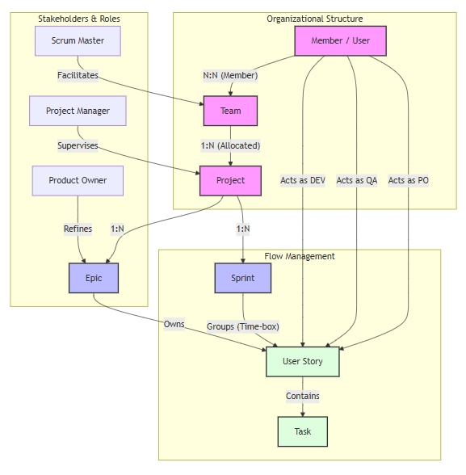

FLOWR a Framework for Logical Organization of Work Resources

**FLOWR** is an agile management ecosystem designed to orchestrate the complete software development lifecycle. It goes beyond a simple Kanban board by integrating high-level engineering concepts with a core focus on **Software Quality (QA)** and **Governance**.

## Project Overview
The project aims to provide a structured environment where Product Owners, Developers, and QA Engineers can collaborate with full traceability—from initial conception to production delivery.

## Initial Structure

## Key Concepts

* **Hierarchical Management:** Seamless flow between Projects, Epics, Sprints, and Tasks.

* **Role-Based Governance:** Built-in support for stakeholders like Project Managers, Scrum Masters, POs, Devs, and QAs.

* **Quality-First Workflow:** Enforced state transitions:
    * `New` ➔ `In Progress` ➔ `QA` ➔ `Ready for Prod` ➔ `Done`
